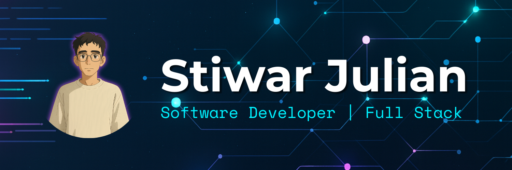

  

   

  # ¡Hola, Soy Stiwar Julian! 👋

  <h3>Software Developer | Full Stack</h3>

  

    Soy un apasionado desarrollador de software con <b>más de 5 años de experiencia</b> profesional. 
    Me especializo en crear soluciones robustas y escalables, combinando lo mejor del ecosistema PHP y JavaScript. 
    Actualmente, aplico mi experiencia y pasión por la tecnología en <b>Solati SAS</b>.
  

  

    
    
  

### 🛠️ Stack Tecnológico

  **Backend & APIs** 
  
  
  
  
  
  

   

  **Frontend & UI** 
  
  
  
  
  
  
  

   

  **Database & DevOps** 
  
  
  
  

 

### 📊 Estadísticas de GitHub

  <table border="0">
    <tr>
      <td>
        
      </td>
      <td>
        
      </td>
    </tr>
  </table>

  
<i>"La tecnología es mejor cuando une a las personas."</i>

  
© 2026 Stiwar Julian

